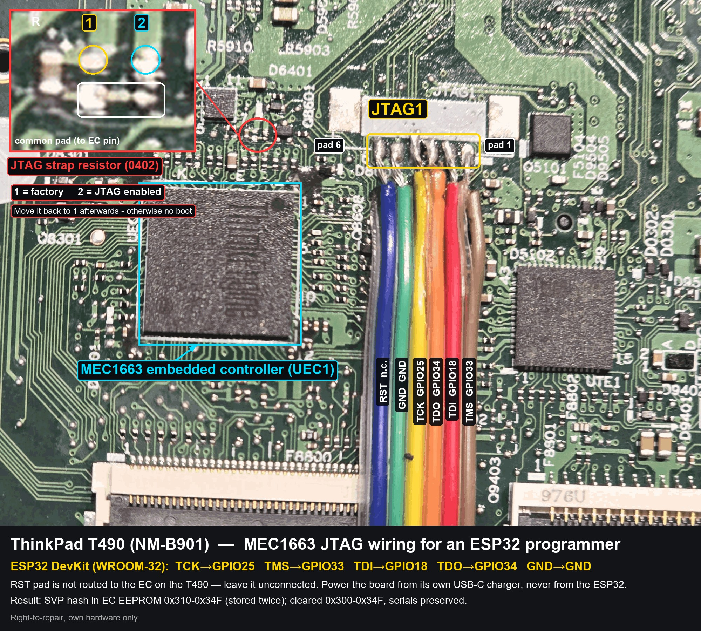

# ThinkPad T490 Supervisor Password (SVP) reset over JTAG — with a $10 ESP32

Reading and clearing the **Supervisor Password** stored inside the **Microchip MEC1663** embedded controller of a Lenovo **ThinkPad T490** (board **NM-B901**), using a plain **ESP32** as a JTAG programmer instead of an expensive commercial tool.

> **TL;DR** — The SVP hash lives in the EC's internal **EEPROM** at `0x310–0x34F` (32 bytes, stored twice). Clearing the `0x300–0x34F` block and fully removing power for 2–3 minutes wipes the password while keeping the serial/DMI data. No RT809H, no Vertyanov/SVOD license — a $10 ESP32 and 5 wires. The one thing that stopped everyone porting the open-source driver was a **JTAG TAP state‑machine bug**, documented and fixed here.

---

## ⚠️ Disclaimer — right to repair only

This is for **recovering access to hardware you legally own** (a board you bought, an inherited/second‑hand laptop whose previous owner forgot to remove the SVP, your own repair bench). It is documented maintenance / right‑to‑repair. **Do not** use it on hardware that isn't yours. None of the information here is new — it consolidates what is already public on badcaps, the Arduino forum and the open‑source Glasgow project.

---

## Why bother

The usual advice for T490‑and‑newer ThinkPads (the Lenovo BIOS auto‑patcher does **not** work on these) is to buy a hardware programmer:

| Tool | Cost | Notes |
|---|---|---|
| RT809H | ~€150–200 | reads full 290 KB EC |
| Vertyanov / SVOD3‑4 + license | ~€50 + jig | SVOD reads only 288 KB on some units |
| **ESP32 + 5 wires (this project)** | **~€5–10** | 3.3 V native, no level shifter |

The driver logic is a faithful port of the open‑source Glasgow `program-mec16xx` applet. The value added here is: it runs on a bare ESP32, and it fixes the bug that makes a naïve port fail.

---

## Hardware

- **ESP32 DevKit** (classic ESP‑WROOM‑32, 38‑pin). Not S3/C3/C6 — the pin mapping differs.
- 5 thin wires (30 AWG) to the board's **JTAG1** pads (next to the MEC1663, marked with a "6" at one end).
- The T490 board powered by its **own USB‑C charger** (battery removed). The EC runs on always‑on 3.3 V standby, so JTAG answers even while the board "cycles" at power‑on. **Do not** power the MEC from the ESP32.

### Wiring

| MEC signal | ESP32 |
|---|---|
| JTAG_CLK (TCK) | GPIO25 |
| JTAG_TMS | GPIO33 |
| JTAG_TDI | GPIO18 |
| JTAG_TDO (input‑only) | GPIO34 |
| JTAG_RST# | **not connected** — the RST pad is dead on the T490 JTAG1 header |
| GND | GND (common ground is mandatory) |

> On the NM‑B901 you must move a tiny **pull‑up resistor** near the EC to enable the JTAG interface, and **move it back afterwards** — otherwise the board stays in debug mode and won't boot normally (no video, USB not powered). See photo below.


*JTAG1 pads wired to the ESP32 (wire colour → signal → ESP32 GPIO), and the JTAG strap resistor: position 1 = factory, position 2 = JTAG enabled.*

---

## The key insight: the TAP state‑machine bug

`IDCODE` (which only uses TCK/TMS/TDO) worked immediately: `IDCODE=0x200024b1` → ARC6xx. But **any** register/memory read failed:

```
ERR ARC transaction FAILED (DR_STATUS.FL=1, status=0xe)
```

I spent a lot of time suspecting the wiring, the strap resistor and the RST pad (which turned out to be **dead** on the T490 — RST is simply not routed to JTAG1, and is not needed).

**Root cause was firmware, not hardware.** The TAP state machine passed through **Run‑Test/Idle** after every IR/DR shift. On the ARC core, **every clock in Run‑Test/Idle starts a transaction** (a quirk documented in the Glasgow applet). The result was phantom transactions → the fail flag `FL=1` on every read. `IDCODE` was fine only because it never uses the RTI state.

**Fix:** keep the TAP in **Update‑xR** between operations and only pass through RTI explicitly, in `runTestIdle()`, where ARC actually wants the pulse. After that, every read started working.

This is the single change that turns a "port of Glasgow that returns `0xFFFFFFFF` everywhere" into a working programmer on custom hardware.

---

## Procedure

1. **Halt the EC.** It sleeps periodically, so halting retries in a loop until it catches an awake window (`MECHALTX`). Halt succeeds in ~0.5 s.
2. **Read the EEPROM** (2 KB). Data is stored **bit‑inverted** (XOR `0xFF` to decode). Two reads give identical MD5 → stable.
3. **Locate the password.** Readable records are `SER#` (serial), `USR#`, `CON#` ("ThinkPad T490"). The password is a 32‑byte high‑entropy blob **stored twice**:

   ```
   0x310  xx xx xx xx xx xx xx xx xx xx xx xx xx xx xx xx  ┐ block A
   0x320  xx xx xx xx xx xx xx xx xx xx xx xx xx xx xx xx  ┘
   0x330  xx xx xx xx xx xx xx xx xx xx xx xx xx xx xx xx  ┐ block A (copy)
   0x340  xx xx xx xx xx xx xx xx xx xx xx xx xx xx xx xx  ┘
   ```

   *(actual bytes redacted — the two 32‑byte halves are identical copies)*

   A marker `89 89` at `0x302` (decoded `76 76`) sits just before it — a "password present" flag. This matches the community offsets `0x330/0x340`.

   > The main **flash (256 KB) is read‑protected** (`status=0x16d` = PROTECT_ERR + BOOT_BLOCK + DATA_BLOCK). Luckily the password is in the **EEPROM**, which is not protected.

4. **Clear it.** The firmware can only clear bits (not set them), and EEPROM erase is global, so the surgical clear is: build a modified image = full backup with `0x300–0x34F` set to `0xFF`, then `erase‑all` + rewrite the whole 2 KB from that image. Serials are restored from the backup; the password block ends up blank.
5. **Remove ALL power for 2–3 minutes**, then reconnect. The password area is mirrored in the EC's RAM — without a full power‑down the EC re‑reads it and nothing changes.
6. **Move the strap resistor back**, reassemble with a keyboard (internal FFC connector — any T490/T495/T590 keyboard, backlit or not), enter BIOS, confirm the SVP prompt is gone.

---

## Verification

After the power cycle, the password block `0x300–0x34F` reads back all `0xFF` (confirmed across two reads, identical MD5), serials intact. The only bytes that change are the EC's own scratch area (`0x354`, `0x35C–0x35F`) — a sign the EC is running normally.

---

## Bonus: the EC has a hidden debug UART on the audio jack

From the NM‑B901 schematic, the MEC1663 exposes a UART on `GPIO104/UART_TX` (ball D12) and `GPIO105/UART_RX` (ball D10), **multiplexed onto the 3.5 mm audio jack** through an analog switch (U8401), gated by `UART_EN`. This is Lenovo's "Audio UART" debug feature. The keyboard, by contrast, is a KSO/KSI scan matrix — not serial.

---

## Troubleshooting

| Symptom | Real cause |
|---|---|
| `FL=1` / `0xFFFFFFFF` on all ARC reads, but IDCODE OK | TAP bug: parasitic RTI transitions → phantom ARC transactions. Not the wiring. |
| RST changes have no effect | RST pad is dead on the T490 (not routed to JTAG1). RST not needed. |
| EC "asleep" between transactions | Periodic sleep → loop the halt until it catches an awake window. |
| EEPROM data unreadable / garbage | Stored bit‑inverted (XOR `0xFF`). |
| Board won't boot / USB unpowered after the mod | Strap resistor still in the "JTAG enabled" position. Move it back. |
| Dump differs on every read | Normal for this part — use majority voting on reads. |

---

## Repository layout

```
firmware/ergProgrammer/   ESP32 firmware (Arduino core, classic ESP32) — JTAG + ARC debug + MEC16xx flash/EEPROM
  jtag.cpp                TAP state machine (the Update-xR fix lives here)
  arc_debug.cpp           ARC debug port (halt, AUX/MEM access)
  mec16xx.cpp             MEC16xx flash + EEPROM controller
  cmd.cpp                 shell commands: MECID, MECHALTX, MECDIAG, MECEERD, MECEEPROG, MECEEERASE
host/memprog.py           host client (serial or TCP) to read/write dumps
img/                      annotated board photo
```

Build with Arduino IDE / arduino-cli, board **ESP32 Dev Module**, partition scheme from `partitions.csv`.
WiFi and backend URLs are empty by default: the shell works over USB serial (921600 baud); set
`SET wifi.ssid` / `SET wifi.pass` for telnet access. Comments in the source are partly in Romanian.

The EEPROM dumps from this board are **not** published (they contain the board serial and the password hash).

## Credits & license

- Driver logic ported from the open‑source **Glasgow Interface Explorer** `program-mec16xx` applet.
- Firmware: **ergProgrammer** — an ESP32 multi‑memory programmer (SPI NOR / I²C / Microwire / MEC16xx JTAG) with a serial/telnet shell.

MIT — see `LICENSE`. Provided as‑is; you are responsible for using it only on hardware you own.
